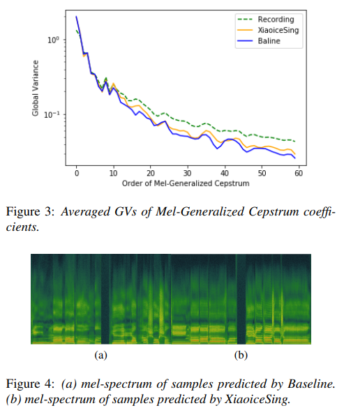

<!-- # XiaoiceSing: A High-Quality and Integrated Singing Voice Synthesis System -->

- Date: June 11, 2020
- Paper: https://arxiv.org/abs/2006.06261 
- Sample: https://xiaoicesing.github.io/

## **Abstract**

XiaoiceSing은 spectrum, F0, duration 모델링을 위한 통합 네트워크를 사용하는 high-quality singing voice synthesis 시스템이다.

FastSpeech의 주요 아키텍처를 따르면서 singing에 특화된 디자인을 제안한다.

1) Phoneme ID 및 position encoding 외에도 musical score의 feautre (note pitch, length)가 추가됨.

2) Off-key issue를 줄이기 위해 F0 prediction에 residual connection이 추가됨.

3) 각 phoneme duration loss를 추가하며, musical score의 모든 phoneme의 duration을 누적하여 리듬 향상을 위한 syllable duration loss를 계산함.

---

## **Introduction**
- Singing voice synthesis에서 표현력있고 리드미컬한 singing을 생성하려면 다음 세가지를 고려해야함.
    1. 명료한 발음, 적절한 음질 및 자연스러움을 위한 spectral feature를 예측하는 강력한 모델
  2. Singing의 F0 contour에서 복잡한 패턴을 설정하기 위한 효과적인 F0 모델
  3. Singing의 리드미컬한 요소를 배울 수 있는 duration 모델
 - XiaoiceSing은 TTS에서 고품질의 빠른 음성 생성을 달성하는 FastSpeech에서 영감을 받았습니다. SVS 작업에 적합하도록 몇가지 수정사항이 있음.
    1. Lyrics의 phone sequence 외에 모든 musical score information이 input으로 인코딩. (note duration, note pitch)
    2. 음정 이탈 문제를 방지하기 위해 note pitch와 predicted F0 사이에 residual connection을 추가.
  - phone duration loss외에도 리듬 향상을 위한 syllable duration loss가 고려됨.
  - Mel-spectrogram보다 mel-generalized cepstrum (MGC)와 band aperiodicity (BAP)를 포함한 vocoder feature를 모델링하고 WORLD vocoder를 사용하여 singing voice를 합성.

---
## **Architecture**
    

    
### **Musical score encoder**
- 일반적으로 musical score는 lyrics, note pitch, note duration을 포함하며, Singing에 필수적.
            

1) lyrics → phoneme ID    
2) note pitch → pitch ID (MIDI standard)
3) note duration
        
- musical score input $S∈R^{N×3}$ 은 phoneme level이며, phoneme 길이는 N
- 개별적으로 dense vector로 임베딩하여 같은 차원을 출력하여 전부 더한 뒤 positional encoding을 적용
- multiple FFT block 적용
### **Duration predictor**
- Pheoneme duration predictor는 1D-CNN으로 구성되며 FastSpeech의 구조를 따르는 length regulator의 sequence expansion을 guide하도록 훈련
- Phoneme duration외에 syllable duration도 SVS 리듬에서 중요한 역할을 함. 따라서 syllable level duration에 대한 control도 추가할 것을 제안
- 특히 note는 항상 가사의 syllable과 관련이 있지만, 한 syllable에 하나 이상의 note가 해당할 수 있기 때문에, ground truth syllable duration과 phoneme duration의 합계와의 사이의 syllable-level duration loss $L_{sd}$를 설계
- Duration predictor의 loss: $L_{dur}=w_{pd}L_{pd}+w_{sd}L_{sd}$
### **Decoder**
- 명시적인 F0 제어로 극도로 높고 낮은 톤의 정확한 표현을 보장하는 WORLD 보코더를 사용. 따라서 디코더는 Mel-spectrogram 대신 MGC 및 BAP feature를 예측.
- Spectral parameter loss $L_{spec}=w_mL_m+w_bL_b$
- Speech에 비해 Singing은 F0 contour가 더 복잡하고 민감하다 → data augmentation으로 해결할 수 있지만 경제적이지 않고 훈련 시간이 길어질 수 있다. 따라서, 그림 1과 같이 input과 output pitch 사이의 residual connection을 제안 (logF0 사용)
- F0 예측에 V/UV decision을 수반
- Decoder의 loss $L_{dec}=L_{spec}+w_{f}*L_f+w_u*L_u$
---
## **Experiment**
### Datasets
- 2297 Mandarin pop song이 전문 녹음실에서 여성 가수로 부터 수집되었으며,  반주에 따라 노래하였고, 녹음에 따라 악보(musical score)가 수동으로 검토됨
- 16비트 48kHz 샘플링, 길이 10초 미만.
- 10761 샘플 (9685 train, 1076 validation and test)
- Acoustic feature: 60-d MGC, 5-d BAP, 1-d logF0 및 1-d V/UV flag 포함하여 15ms frame shift (by WORLD)
- 훈련에서 사용되는 phoneme duration label은 HMM-based forced alignment에 의해 획득됨.
### **System configurations**
1. Encoder와 decoder 모두 6개의 FFT blocks.
2. phoneme vocabulary의 size는 72
3. Encoder는 입력된 musical score를 384-d vector로 변환, decoder는 67-d acoustic feature를 출력.
4. MGC, BAP, LogF0의 loss는 L1 regularization loss 사용
5. V/UV decision loss는 binary cross entropy 사용
6. Duration predictor는 2 layer 1-d CNN (FastSpeech와 동일)
7. Phoneme 및 note duration 모두 L1 regulation loss 사용
8. 다른 hyper-parameter는 FastSpeech와 동일하게 적용
9. Batch size는 32개의 문장이며, 40K iterations
### **Overall performance**

- XiaoiceSing은 발음 정확도, 음질, 자연성 모두 baseline을 능가합니다. 
- 그리고, 정확한 phoneme duration, F0 및 spectral feauture를 생성한다.
- 또한, MGC 계수의 average global variance와 plot을 보았을때, 고주파 성분에서 보다 견고하고 뚜렷함을 알 수 있음.

      
### **Evaluation on F0 modeling**
1. F0 contour의 correctness와 dynamics를 평가하기 위해 A/B 테스트를 수행
2. 97.3%의 XiaoiceSing가 1.7%의 Baseline을 압도.
3. 두 시스템은 note의 pitch를 정확하게 표현할 수 있지만, LSTM 모델에서 예측한 F0는 over-smoothed되고 비브라토와 같은 F0 contour의 dynamics를 표현할 수 없음. XiaoiceSing은 recorfing에 훨씬 더 가까움.

### **Evaluation on duration modeling**
1. XiaoiceSing이 84.3%로 14.3%의 baseline을 압도
2. 그림 7에서는 XiaoiceSing이 recording에 더 가깝게 예측하는 것을 알 수 있음.

            
---      
## **Conclusion**
1. 고품질 SVS 시스템 XiaoiceSing을 제시
2. stacked CNN 및 attention network를 사용, 시간 축에 따라 remote dependencies를 잘 모델링할 수 있다.
3. 실험 결과는 baseline에 비해 음질, 발음 정확도, 자연스러움에서 큰 이점을 보여준다.
4. 특히, note pitch와 predicted F0 사이의 residual connection으로 인해 F0 지각성능이 우수하고, expected syllable duration과 predicted phone duration 사이에 syllable duration constraint를 추가하여 duration prediction에 대한 확연한 개선이 있었다.